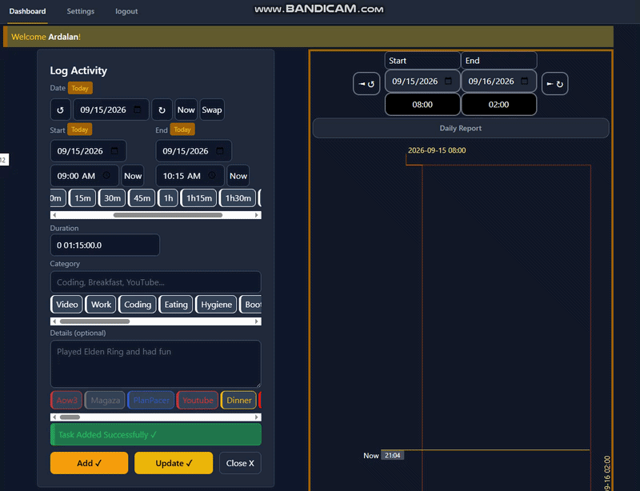

# PlanPacer

> **Understand your time. Shape your life.**

PlanPacer is a **time logging and life analytics web application** built to help you understand how you actually spend your time — not how you planned to spend it.

It is designed around the idea that your daily activity data can reveal patterns in your habits, productivity, and overall use of time.

## What is it?

PlanPacer is **not a traditional to-do app**.



Instead of focusing primarily on what you *should* do, PlanPacer focuses on what you **actually did**.

It helps answer questions such as:

* Where did my day go?
* How much time did I spend working, studying, gaming, or resting?
* How does my actual day compare with what I intended to do?
* What activities take up most of my time?
* What patterns keep repeating?
* How does my mood or progress relate to how I spend my time?

The goal is to turn everyday activity logs into useful information for **reflection and self-understanding**.

---

## Features

* 📝 **Activity logging** — Record what you actually spend your time doing
* ⏱️ **Time tracking** — Activities are tracked using precise start and end times
* 📅 **Daily timeline** — View your day as a chronological timeline
* 🏷️ **Categories** — Organize activities into customizable categories
* 📊 **Statistics** — Analyze how your time is distributed across activities
* 📝 **Activity details** — Add additional context and descriptions to activities
* 🌍 **Timezone-aware tracking** — Time calculations account for the user's local timezone
* 📱 **Responsive interface** — Designed to work across desktop and mobile devices
* 🔐 **Authentication** — User accounts and authentication are handled securely
* ☁️ **Online access** — Your data can be accessed through the deployed application

---

## How It Works

A day in PlanPacer is represented as a collection of activities with specific time ranges.

For example:

```text
08:30 ── Wake up
09:00 ── Job Search
10:00 ── Work
13:00 ── Lunch
14:00 ── Programming
17:30 ── Gaming
19:00 ── Personal Projects
22:00 ── Rest
```

These individual records can then be used to understand the bigger picture:

```text
Work             ███████
Programming      █████
Gaming           ████
Study            ███
Rest             █████████
```

The purpose isn't simply to produce charts.

The purpose is to make **patterns in your life visible**.

---

## Tech Stack

* **Laravel 12**
* **PHP 8.5**
* **Livewire 3**
* **TailwindCSS**
* **SQLite**
* **Laravel Fortify** — authentication
* **Laravel Sanctum**
* **JavaScript** — browser timezone detection
* **Git / GitHub**

---

## Architecture & Data

PlanPacer stores activity times as Unix timestamps while using the browser's timezone information to correctly represent those times for the user.

User-specific settings such as:

* Timezone
* Day start time
* Day end time
* Average day settings

are kept separately from the main user account data.

This allows the application to treat a user's **day as something configurable**, rather than assuming that every day starts and ends at the same fixed times.

---

## Project Goals

PlanPacer is being developed as more than a CRUD demonstration.

The long-term goal is to build a system capable of connecting different aspects of daily life — **time, activities, mood, and progress** — and using that information to provide meaningful feedback.

For example, accumulated data could eventually reveal patterns such as:

> "On days when you sleep later than usual, your productive programming time tends to decrease."

or:

> "You tend to get significantly more programming done when you start Laravel work before browsing social media."

The emphasis is on **reflection based on actual data**, rather than generic productivity advice.

---

## Roadmap

### In Progress

* [ ] Improve category and activity data structure
* [ ] Improve category color handling
* [ ] Improve activity descriptions
* [ ] Improve task/activity table
* [ ] Pagination for activity history
* [ ] Account settings
* [ ] Change password functionality
* [ ] Daily AI-generated inspiration
* [ ] Improve documentation

### Planned

* [ ] Better analytics
* [ ] Weekly reports
* [ ] Monthly reports
* [ ] Spatial timeline
* [ ] Proportional timeline
* [ ] More detailed activity statistics
* [ ] Data export
* [ ] Deeper pattern detection
* [ ] AI-assisted life/time analysis

---

## Status

🚧 **Active development**

PlanPacer is an evolving personal project. Features and internal architecture are still being refined as the application grows.

---

## Philosophy

> **Every day tells a story.**
>
> **Plan it. Pace it. Perfect it.**

PlanPacer is built around a simple idea:

**You cannot meaningfully change what you cannot see.**

By recording where your time actually goes, you can start understanding the patterns behind your days — and use that understanding to make better decisions about how you spend them.
